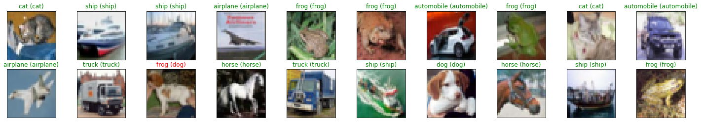

# cifar10-cnn-exercise
A model to classify images from the CIFAR-10 dataset using PyTorch. The model uses 3 Convolutional Layers, Maxpooling Layers, 
3 Fully Connected(Linear Layers) and Dropout Layers with 50% probability.

# test loss and accuracy for all image classes
Test Loss: 0.787522  
 
Test Accuracy of airplane: 76% (760/1000)  
Test Accuracy of automobile: 87% (871/1000)  
Test Accuracy of  bird: 60% (600/1000)  
Test Accuracy of   cat: 56% (564/1000)  
Test Accuracy of  deer: 69% (692/1000)  
Test Accuracy of   dog: 61% (612/1000)  
Test Accuracy of  frog: 81% (815/1000)  
Test Accuracy of horse: 78% (785/1000)  
Test Accuracy of  ship: 87% (871/1000)  
Test Accuracy of truck: 83% (831/1000)  

# overall accuracy
Test Accuracy (Overall): 74% (7401/10000)

# model's weaknesses and how might they be improved
model is doing really poorly in classifying animals especially those with varying colors like cats and birds. 
Create another Convolutional layer that classifies finer details such as colors. 
A lower learning rate also, so that there's is faster convergence. Augmentation might also improve the model.

# sample predictions

